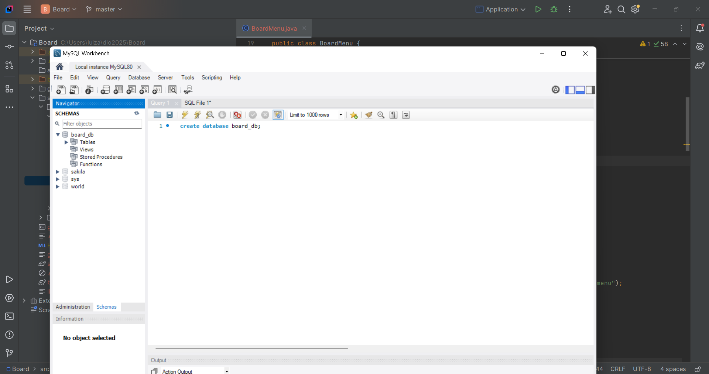
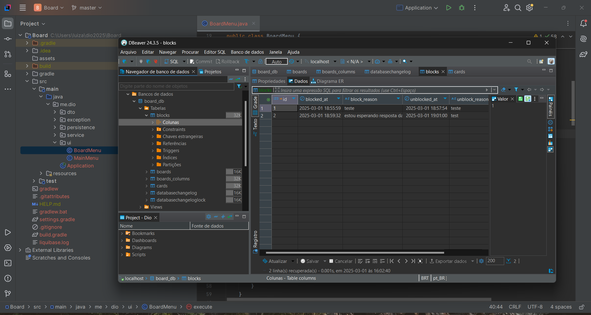
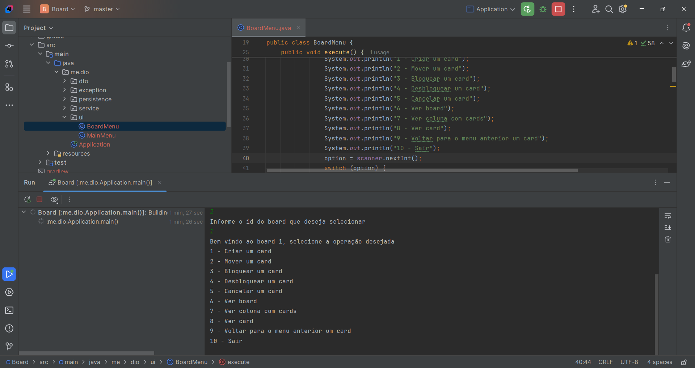

# ☕ Board Gerenciador de Tarefas com Java  

Este projeto consiste na construção de um **board customizável de tarefas** utilizando **Java**, **Maven**, **Liquibase** e **MySQL**, seguindo boas práticas de programação.  

## 🚀 Tecnologias Utilizadas  

As principais tecnologias e ferramentas utilizadas no projeto são:  

    
    
    

  

## 📋 Requisitos do Projeto  

- O código deve iniciar exibindo um menu com as opções:  
  - Criar novo board  
  - Selecionar board  
  - Excluir boards  
  - Sair  
- O sistema deve salvar os boards e suas informações no banco de dados MySQL.  

## 🎯 Regras do Board  

- Cada **board** deve ter um **nome** e ser composto por pelo menos **3 colunas**:  
  - **Coluna inicial** → onde o card é colocado inicialmente  
  - **Coluna de tarefas concluídas**  
  - **Coluna de tarefas canceladas**  
- As colunas possuem:  
  - **Nome**  
  - **Ordem dentro do board**  
  - **Tipo**: Inicial, Cancelamento, Final ou Pendente  
- Restrições:  
  - Um board pode ter apenas **1 coluna inicial, 1 de cancelamento e 1 final**.  
  - Colunas do tipo **pendente** podem ser adicionadas livremente.  
  - A **coluna inicial** deve ser a **primeira** do board.  
  - A **coluna final** deve ser a **penúltima**.  
  - A **coluna de cancelamento** deve ser a **última**.  
- Cada coluna pode conter **0 ou mais cards**.  
- Cada **card** possui:  
  - **Título**  
  - **Descrição**  
  - **Data de criação**  
  - **Status de bloqueio**  
- Regras de movimentação dos cards:  
  - Os cards devem **seguir a ordem das colunas no board**, sem pular etapas.  
  - Exceção: um card pode ser movido diretamente para a coluna de **cancelamento** a partir de qualquer coluna.  
  - Um **card bloqueado não pode ser movido** até ser desbloqueado.  
  - Para bloquear um card, é necessário informar o **motivo**.  
  - Para desbloquear um card, também é necessário informar o **motivo**.  

## 🖥️ Menu de Manipulação do Board  

Dentro de um board selecionado, o menu deve permitir:  
✅ **Mover** um card para a próxima coluna  
❌ **Cancelar** um card  
➕ **Criar** um novo card  
🔒 **Bloquear** um card  
🔓 **Desbloquear** um card  
📌 **Fechar o board**  

---

## 📂 Imagens do Projeto  

As imagens do funcionamento do projeto estão disponíveis abaixo:  

   
  
    
    

  
